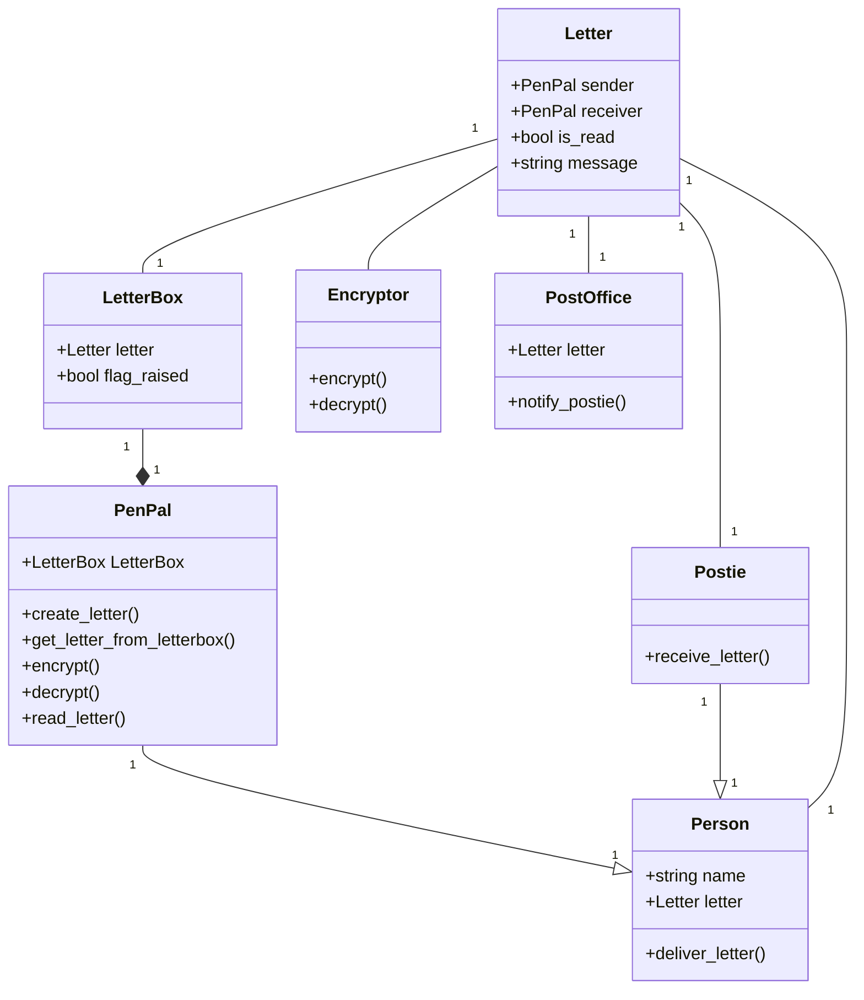

# Project Description
This project will continue on from task 02
of applied python. (Bob and Alice)
It will also add some additional stuff
which means that you may need to update
some UML diagrams to fit accordingly to
the new program

# UML Diagrams
This section will contain the UML diagrams

## Class Diagram
